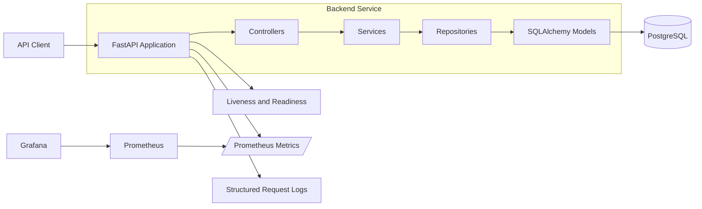

# Event Service Backend

A production-inspired backend engineering portfolio project built with FastAPI, async PostgreSQL, structured logging, health probes, and Prometheus/Grafana observability.

This repository focuses on maintainable service boundaries, reliable database workflows, observable API design, and repeatable local environments. It is intentionally compact so reviewers can evaluate the architecture, code organization, and operational thinking without navigating a large application.

## Why This Repo Exists

This project demonstrates how I approach backend engineering beyond basic API implementation. It focuses on maintainable service boundaries, reliable database workflows, structured observability, repeatable local environments, and clear documentation of engineering decisions.

The goal is to show production-oriented backend thinking in a compact, reviewable system: how services are structured, how operational signals are exposed, how failures can be diagnosed, and how the codebase can evolve without becoming tightly coupled.

## What This Project Demonstrates

- Layered FastAPI service design using controller, service, repository, model, and schema boundaries
- Async PostgreSQL access with SQLAlchemy and asyncpg
- Database schema management with Alembic migrations
- Request validation and response serialization with Pydantic
- Liveness and readiness health checks for reliable runtime workflows
- Prometheus metrics for request volume, latency, and error visibility
- Grafana dashboard provisioning for local observability review
- Structured JSON request logging with request IDs
- Docker Compose environment for local development and reviewer setup
- DevLog documentation that records architecture decisions, tradeoffs, and implementation notes

## Architecture



The service manages event records through a layered backend. The supporting runtime exposes operational signals through health checks, request metrics, structured logs, and Docker health checks so failures are easier to identify during local review and future deployment work.

## Tech Stack

| Area | Technology |
| --- | --- |
| API | Python, FastAPI, Uvicorn |
| Database | PostgreSQL 16, SQLAlchemy async ORM, asyncpg |
| Migrations | Alembic |
| Validation | Pydantic |
| Observability | Prometheus, Grafana, prometheus-client |
| Runtime | Docker, Docker Compose |
| Testing | pytest, httpx |
| Logging | python-json-logger, request logging middleware |

## Repository Structure

```text
.
|-- python_api/
|   |-- app/
|   |   |-- controllers/     # HTTP route handlers
|   |   |-- services/        # Business logic and orchestration
|   |   |-- repositories/    # Data access layer
|   |   |-- models/          # SQLAlchemy models
|   |   |-- schemas/         # Pydantic schemas
|   |   |-- middleware/      # Metrics and request logging
|   |   `-- core/            # Config, database, logging, metrics
|   |-- alembic/             # Database migrations
|   |-- tests/               # API tests
|   `-- Dockerfile
|-- ops/
|   |-- prometheus/          # Prometheus scrape configuration
|   |-- grafana/             # Grafana provisioning and dashboards
|   `-- loki/                # Future log shipping configuration groundwork
|-- DevLog/                  # Engineering notes and decision records
|-- docker-compose.dev.yml   # Local development stack
`-- docker-compose.yml       # Production-style compose stack
```

## API Capabilities

| Method | Endpoint | Purpose |
| --- | --- | --- |
| `GET` | `/health/live` | Liveness probe for process-level health |
| `GET` | `/health/ready` | Readiness probe with database connectivity check |
| `GET` | `/events/` | List events |
| `POST` | `/events/` | Create an event |
| `GET` | `/events/stats` | Return event counts |
| `GET` | `/metrics` | Prometheus metrics endpoint |
| `GET` | `/docs` | Interactive OpenAPI documentation |

Example event payload:

```json
{
  "id": "deploy-001",
  "name": "Deployment completed",
  "description": "Production deployment finished successfully"
}
```

## Engineering Decisions

**Layered architecture:** Controllers, services, repositories, models, and schemas are kept separate so request handling, business rules, persistence, and validation can evolve independently. In a small project this adds some structure, but it makes the service easier to extend and review.

**Async PostgreSQL access:** FastAPI, SQLAlchemy async sessions, and asyncpg were used because API workloads commonly spend time waiting on database I/O. The async approach supports concurrent request handling while keeping database access explicit through dependency-managed sessions.

**Separate liveness and readiness checks:** Liveness confirms the application process can respond. Readiness checks whether the service can safely handle traffic by verifying database connectivity. Splitting these concerns mirrors how container platforms distinguish between restarting an unhealthy process and temporarily removing a service from traffic.

**Prometheus and Grafana:** Metrics and dashboards were added to make API behavior visible during local review: request volume, latency, and error counts can be inspected without adding route-specific instrumentation everywhere.

**DevLog:** The DevLog exists to document design intent, tradeoffs, and corrections as the project evolves. It gives reviewers context for why the code is shaped the way it is, not only what was implemented.

## Running Locally

1. Clone the repository:

```bash
git clone https://github.com/<your-username>/devops-event-system.git
cd devops-event-system
```

2. Create your environment file:

```bash
cp .env.example .env
```

On Windows PowerShell:

```powershell
Copy-Item .env.example .env
```

For Grafana in the development stack, make sure `.env` includes:

```env
GF_SECURITY_ADMIN_USER=admin
GF_SECURITY_ADMIN_PASSWORD=admin123
GF_USERS_ALLOW_SIGN_UP=false
```

3. Start the development stack:

```bash
docker compose -f docker-compose.dev.yml up --build
```

4. Open the services:

| Service | URL |
| --- | --- |
| FastAPI docs | http://localhost:8000/docs |
| Liveness check | http://localhost:8000/health/live |
| Readiness check | http://localhost:8000/health/ready |
| Prometheus | http://localhost:9090 |
| Grafana | http://localhost:3003 |

Grafana credentials are read from `.env`. The example file uses placeholders, so set local credentials before sharing or running the stack outside a local development environment.

## Running Tests

From the `python_api` directory:

```bash
pip install -r requirements.txt
pytest
```

For local development outside Docker, make sure `DATABASE_URL` points to a reachable PostgreSQL instance before using endpoints that require persistence.

## Observability

The API exposes Prometheus metrics through `/metrics`, including:

- `http_requests_total`
- `http_errors_total`
- `http_request_duration_seconds`

Prometheus is configured to scrape the FastAPI service, and Grafana is provisioned with datasource and dashboard configuration under `ops/grafana`.

Request logging middleware adds an `X-Request-ID` response header and emits structured logs containing method, path, status code, request ID, and request duration.

## Engineering Notes

The `DevLog` directory documents project decisions and implementation history:

- [0001: Project Foundation](./DevLog/0001_kickstart_project.md)
- [0002: Backend Implementation](./DevLog/002_backend_implementation.md)
- [0003: Operational Signals and Reviewability](./DevLog/0003_operational_signals_and_reviewability.md)

These notes are included to show the reasoning process behind the architecture and the tradeoffs made while keeping the system small enough to review.

## Roadmap

Planned improvements:

- Add CI workflows for linting, tests, and Docker image validation
- Expand test coverage across service and repository layers
- Add authentication and authorization for protected API workflows
- Add API versioning once multiple client contracts need support
- Complete centralized log shipping with Loki and Promtail
- Add distributed tracing with OpenTelemetry
- Add deployment examples for a managed container platform
